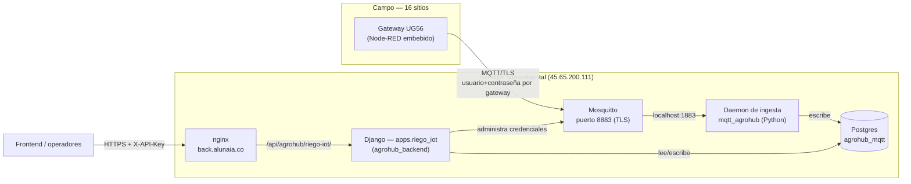

<title>Instalación — Riego IoT AgroHub</title>

# Documentación técnica — Infraestructura de riego IoT AgroHub

**Última actualización:** 2026-08-30 · **Estado:** en producción, 16 gateways dados de alta

Este documento describe cómo quedó montada la infraestructura que recibe, persiste y administra
los gateways de riego AgroHub (Milesight UG56) — el broker MQTT, el servicio que ingiere los
datos, y la API de administración. Complementa (no reemplaza) el manual del fabricante:
`SL-ENT-2026-001 Manual de Usuario - Gateway Riego UG56 - AgroHub.pdf`, incluido en el repo
`mqtt_agrohub`, que documenta la lógica que corre **dentro** de cada gateway.

---

## 1. Arquitectura general



Tres piezas con responsabilidades separadas a propósito:

| Pieza | Qué hace | Repo | Por qué está separada |
|---|---|---|---|
| **Mosquitto** (broker) | Acepta las conexiones TLS de los 16 gateways, enruta mensajes por tópico | — (paquete del sistema) | Software maduro en C — sostener conexiones 24/7 no se reinventa |
| **Daemon de ingesta** | Se suscribe a todos los gateways, valida y guarda cada mensaje en Postgres; publica el "latido de nube" cada 60s | `mqtt_agrohub` | Proceso siempre-activo, no es una API — no encaja en el modelo request/response de Django |
| **API de administración** | Alta/baja/rotación de credenciales de gateways, dashboard de telemetría | `agrohub_backend` (`apps.riego_iot`) | Es lo que consume el frontend — vive en el backend Django del proyecto por decisión explícita, aunque los datos sigan en Postgres |

## 2. Dónde vive cada cosa

**Servidor:** `hubambiental002@45.65.200.111`, SSH puerto **16022** (no el 22 estándar).

| Componente | Ruta en el servidor | Servicio systemd | Puerto |
|---|---|---|---|
| Mosquitto | `/etc/mosquitto/` | `mosquitto` | 8883 (público, TLS) / 1883 (interno, `127.0.0.1`) |
| Daemon de ingesta | `~/backend_stacks/mqtt_agrohub/` | `mqtt-agrohub` | — (no escucha, solo se conecta) |
| Base de datos de telemetría | contenedor Docker `agrohub_mqtt_db` | (docker compose, en `mqtt_agrohub/`) | 5434 → 5432 (Postgres 16, solo `127.0.0.1`) |
| API de administración | `~/backend_stacks/agrohub_backend/` (rama `migration_django`) | `agrohub-backend` | 8001 (interno) → nginx `/api/agrohub/` |

**Repos:**
- [`mqtt_agrohub`](https://github.com/AlexEspinosa98/mqtt_agrohub) — broker, daemon de ingesta, scripts de infraestructura.
- [`agrohub_backend`](https://github.com/AlexEspinosa98/agrohub_backend), rama `migration_django` — API de administración (`apps/riego_iot/`).

## 3. Dominio y certificado — sin subdominio nuevo

MQTT (incluso sobre TLS) es un protocolo TCP crudo, no HTTP — no tiene "rutas" como `/mqtt`, así
que no se enruta por path detrás de nginx. En vez de tramitar un subdominio nuevo, los gateways
se conectan directo a **`back.alunaia.co:8883`**, reusando el certificado Let's Encrypt que ya
existe para ese dominio (el mismo que usa nginx en 443). Un hook de renovación
(`mosquitto/certbot-deploy-hook.sh`) copia el certificado a un lugar que Mosquitto puede leer y
lo recarga automáticamente cada vez que certbot renueva — no requiere mantenimiento manual.

## 4. Seguridad

- **TLS obligatorio** en el puerto público 8883 — el puerto 1883 (sin cifrar) solo escucha en
  `127.0.0.1`, nunca expuesto a internet.
- **Un usuario/contraseña por gateway** (`ug56-agrohub1` ... `ug56-agrohub16`), nunca uno
  compartido — permite revocar el acceso de uno sin tocar los demás.
- **ACL por tópico**: cada gateway solo puede publicar en su propio namespace
  (`ahub/<device_id>/...`) y leer únicamente su propio tópico de control y el latido de nube —
  nunca los datos de otro gateway. Ver `mqtt_agrohub/docs/TOPICS.md` para el detalle exacto de
  cada permiso.
- **API de administración**: un solo header `X-API-Key`, pensado para el puñado de operadores
  internos que dan de alta/baja gateways — no es un esquema de usuarios finales.

### Grupo `mosquitto-admin` — quién puede tocar las credenciales

La API (proceso Django) necesita crear/editar/borrar usuarios de Mosquitto. Esto se resuelve con
un grupo de sistema, **no** dándole sudo a la aplicación:

```bash
sudo groupadd -f mosquitto-admin
sudo usermod -aG mosquitto-admin hubambiental002   # el usuario que corre Django
sudo usermod -aG mosquitto-admin mosquitto          # el propio Mosquitto TAMBIÉN
sudo chgrp mosquitto-admin /etc/mosquitto/passwd /etc/mosquitto/acl.conf /etc/mosquitto
sudo chmod 660 /etc/mosquitto/passwd /etc/mosquitto/acl.conf
sudo chmod g+w /etc/mosquitto
```

Además, una regla de sudoers **acotada a un solo comando exacto** (no sudo general) para que la
API pueda avisarle a Mosquitto que recargue sus credenciales sin reiniciar el broker entero:

```bash
echo 'hubambiental002 ALL=(root) NOPASSWD: /bin/systemctl reload mosquitto' | sudo tee /etc/sudoers.d/mqtt-agrohub-api
sudo chmod 440 /etc/sudoers.d/mqtt-agrohub-api
```

> **Dos errores reales que costó descubrir** (documentados aquí para que no se repitan):
> 1. Si se agrega el usuario de la app al grupo pero **no** al propio Mosquitto, el broker sigue
>    funcionando mientras tenga el archivo de contraseñas ya abierto — pero en el próximo
>    reinicio real no puede reabrirlo y se cae en loop (`Unable to open pwfile`). Hay que agregar
>    **ambos** usuarios al grupo.
> 2. `mosquitto_passwd` escribe primero un archivo temporal en el mismo directorio antes de
>    reemplazar el original — hace falta permiso de escritura sobre el **directorio**
>    `/etc/mosquitto/`, no solo sobre el archivo `passwd`. Sin esto, cada alta/baja/rotación
>    falla con `Error creating backup password file`.

## 5. Bases de datos

| Base | Motor | Dueño de los datos | Uso |
|---|---|---|---|
| `agrohub_mqtt` | Postgres 16 (Docker, puerto 5434) | Daemon de ingesta (`mqtt_agrohub`) | Telemetría, estados de válvula, healthchecks, dispositivos |
| `agrohub` | MySQL (puerto 3306) | Django `agrohub_backend` | Todo lo demás del backend (encuestas CGSM, etc.) — **no tocado** por esta integración |

`apps.riego_iot` en Django se conecta a Postgres como una **segunda base de datos** (alias
`mqtt`), con modelos `managed = False` — Django nunca corre migraciones sobre esas tablas, las
sigue escribiendo el daemon de ingesta. El único modelo que la API escribe directamente es
`Dispositivo` (metadatos: `device_id`, `client_id`, `nombre`, `activo`). Ver
`config/db_routers.py` en `agrohub_backend` para el enrutador que separa ambas bases.

**Por qué no se migró todo a una sola base:** unificar hubiera significado tocar a la vez el
daemon de ingesta (ya probado, con 16 gateways reales dependiendo de él) y la nueva API — dos
cambios riesgosos al mismo tiempo sin beneficio inmediato. Queda como mejora futura si el
proyecto decide unificar el almacenamiento.

## 6. Cómo dar de alta un gateway nuevo

Dos mitades — una en el servidor, otra en el gateway físico:

**1. Crear la credencial** (vía API, ver `API_RIEGO_IOT.md` en `agrohub_backend` para el detalle):

```bash
curl -X POST https://back.alunaia.co/api/agrohub/riego-iot/dispositivos/ \
  -H "X-API-Key: <la API key>" -H "Content-Type: application/json" \
  -d '{"device_id": "device0017", "client_id": "ug56-agrohub17", "nombre": "Nombre del sitio"}'
```

La respuesta trae la contraseña generada **una sola vez** — guardarla ahí mismo, no se puede
volver a consultar.

**2. Configurar el gateway físico** — UI web del UG56 → Node-RED → nodo "Servidor MQTT" (ver
manual, sección 03, Paso 3):
- Host: `back.alunaia.co` · Puerto: `8883` · TLS: sí
- Usuario y Client ID: el `client_id` del paso 1
- Password: la generada en el paso 1
- Keepalive: 15s · Clean session: **desactivado**

Y en el nodo "Config inicial (EDITAR AQUI)" (manual, sección 05):
- `baseTopic`: `ahub/<device_id>`
- `device_id`: el mismo `device_id` del paso 1 — **debe coincidir exactamente**, un desajuste
  mezcla datos de dos gateways distintos.

## 7. El "latido de nube" — la pieza más delicada del sistema

El daemon de ingesta publica `iotunimagdalena/cloud/health` cada 60 segundos, **sin retener**.
Mientras un gateway reciba ese latido (ventana de 3 minutos) y tenga conexión, deja el control de
riego en manos de la nube — la plataforma publica comandos en
`ahub/<device_id>/control/valvulas`. Si el latido deja de llegar, **cada gateway pasa solo a
control local** (histéresis por humedad de suelo) — es el comportamiento correcto y deseado, pero
implica que **si el daemon de ingesta se cae, los 16 gateways pasan a modo local en silencio**,
sin que nadie lo note salvo revisando el dashboard. Por eso corre con `Restart=always` a nivel de
systemd. Ver `mqtt_agrohub/README.md`, sección correspondiente, para el detalle completo.

## 8. Verificación rápida — "¿está todo sano?"

```bash
systemctl is-active mosquitto mqtt-agrohub agrohub-backend
sudo ss -tlnp | grep -E '1883|8883'   # ambos deben aparecer, 8883 en 0.0.0.0
curl -s https://back.alunaia.co/api/agrohub/riego-iot/dispositivos/?solo_activos=true \
  -H "X-API-Key: <la API key>"
```

Si `en_linea` de un dispositivo específico interesa, `GET .../riego-iot/dashboard/<device_id>/`
lo indica directamente (ver `API_RIEGO_IOT.md`).

## 9. Referencias

- Manual del fabricante: `SL-ENT-2026-001 Manual de Usuario - Gateway Riego UG56 - AgroHub.pdf`
  (raíz del repo `mqtt_agrohub`) — contenido definitivo sobre tópicos, payloads y la lógica que
  corre dentro del gateway.
- `mqtt_agrohub/docs/TOPICS.md` — referencia rápida de tópicos MQTT y formatos de payload.
- `mqtt_agrohub/README.md` — instrucciones de despliegue paso a paso, con todos los comandos.
- `agrohub_backend/apps/riego_iot/` — código de la API de administración.
- Soporte del fabricante del gateway: Sierra Lab S.A.S. — mario@sierralab.co / +57 317 676 7905.
